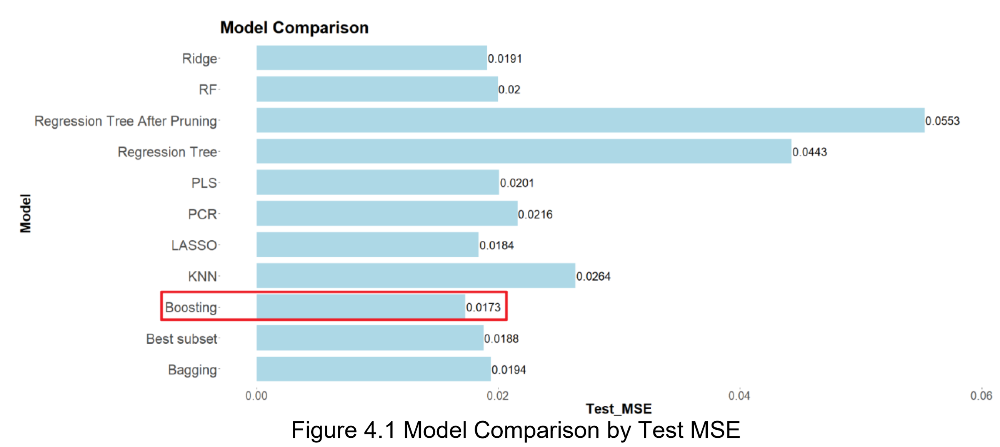
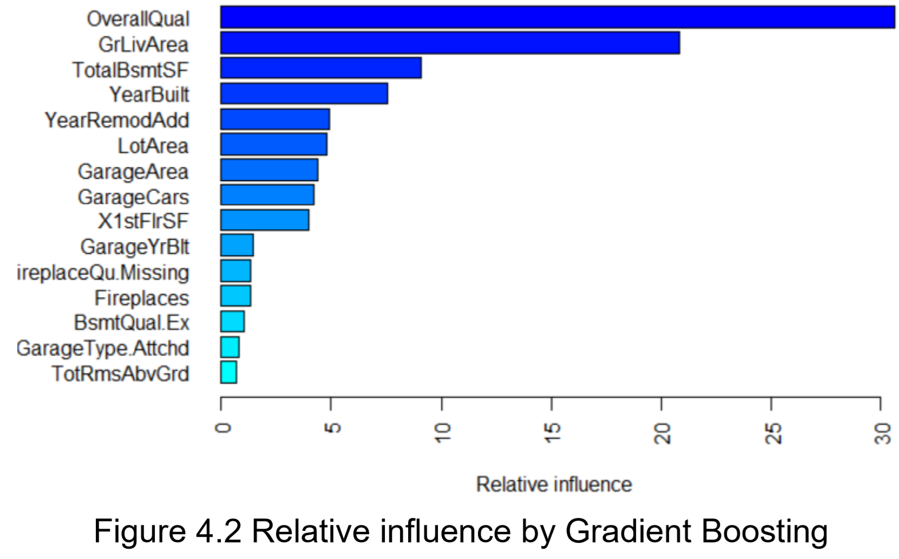

# Best-Model-for-Predicting-House-Prices-in-Ames-Iowa
Machine Learning in R

Our team is trying to find the best model to predict the final price of residential homes in Ames, Iowa. The dataset consists of independent variables that may or may not affect the values of properties in Ames, Iowa. Some examples are roofing types, last remodeled date, etc. Our data source is from Kaggle.com’s House Prices: Advanced Regression Techniques competition. The data set has 80 independent variables and 1 dependent variable, consisting of 1460 observations (450 kb). The dependent variable is the sale price of properties.

We used main machine learning algorithms such as regularization methods (Lasso and Ridge), Dimension Reduction Methods (Principal Component Regression, Partial Least Squares) and some non-linear regression (KNN, regression tree, bagging and random forest, and boosting).

Among all models we discussed and tested above, the gradient boosting model has the lowest test MSE at 0.0173. Therefore, the gradient boosting model is our best performing model. The bar chart below shows the relative influence of the top 15 most important variables selected by gradient boosting. According to the chart, OverallQual (Overall material and finish quality) and GrLivArea (Above grade (ground) living area square feet) are much more significant in predicting house prices in Ames, IA, than other predictors.

